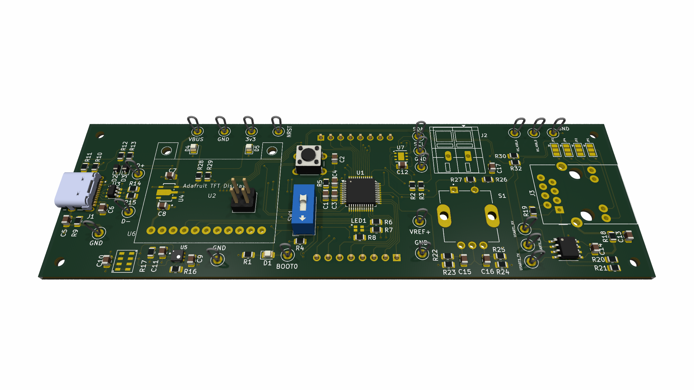

# STM32 Dev Board

Carte de développement autour d'un microcontrôleur STM32, conçue pour l'acquisition de données environnementales, la communication industrielle et l'expansion vers breadboard ou systèmes embarqués tiers.

> **Contenu actuel du dépôt :** projet KiCad (schématique + layout PCB).

---



---

## Fonctionnalités

### Acquisition — bus I²C
Quatre capteurs partagent le même bus I²C :
- Pression barométrique
- Qualité de l'air (COV / CO₂ équivalent)
- Température
- Humidité relative

### Affichage & stockage — bus SPI
- Écran (type TFT ou e-ink selon variante)
- Lecteur de carte microSD pour journalisation locale

### Connectivité USB
Connecteur **USB-C** câblé directement au microcontrôleur (Full-Speed). Les broches `CC1` et `CC2` sont reliées à deux canaux **ADC** du STM32, permettant de lire la puissance négociée avec l'hôte USB.

### Communication industrielle — RS-485 / RJ45
Port **RJ45** utilisé comme connecteur de terrain pour un bus **RS-485** :
- Piloté via **UART** du MCU
- **Pin de direction** (DE/RE) exposé pour la gestion half-duplex
- Alimentation **48 V** optionnelle injectée sur le bus RS-485 et sur le RJ45 via un connecteur **Wago** monté sur la carte (alimentation fantôme ou PoE industriel)

### Interface utilisateur
- **LED RGB** (pilotée GPIO ou PWM)
- **Encodeur rotatif** avec bouton-poussoir intégré

### Extension — Port B
Deux **pin headers 8 broches** (2 × 8 = 16 broches) exposant l'intégralité du **Port B** du STM32. Permet de connecter la carte à une breadboard, un shield ou tout autre sous-système externe sans soudure.

---

## Brochage résumé

| Bus / Signal | Interface STM32 | Connecteur carte |
|---|---|---|
| Capteurs environnementaux | I²C (SDA / SCL) | Interne |
| Écran + SD | SPI (MOSI / MISO / SCK / CS×2) | Interne |
| USB | USB_DP / USB_DM | USB-C |
| Détection puissance USB | ADC (ACC1, ACC2) | Interne |
| RS-485 | UART TX/RX + GPIO DIR | RJ45 |
| Alimentation 48 V | — | Wago |
| LED RGB | GPIO / TIM (PWM) | Interne |
| Encodeur rotatif | GPIO (A, B, SW) | Interne |
| Port B | GPIOB[0..15] | 2× header 8 pins |

---

## Structure du dépôt

```
.
├── hardware/
│   ├── stm32-devboard.kicad_pro   # Projet KiCad
│   ├── stm32-devboard.kicad_sch   # Schématique
│   ├── stm32-devboard.kicad_pcb   # Layout PCB
│   ├── symbols/                   # Table des bibliothèques de symboles
│   ├── footprint/                 # Table des bibliothèques d'empreintes
│   └── 3d_models/                 # Table des bibliothèques de model 3d
└── README.md
```

---

## Prérequis

- **KiCad 8.x** ou supérieur
- Bibliothèques KiCad standard (incluses dans l'installation par défaut)

---

## Futures Amlelioration

- Ajout de pin d'alim et de masse sur les pin du port B
- Diodes TVS et sécurité sur bus RS_485 (Alim et signaux)

---