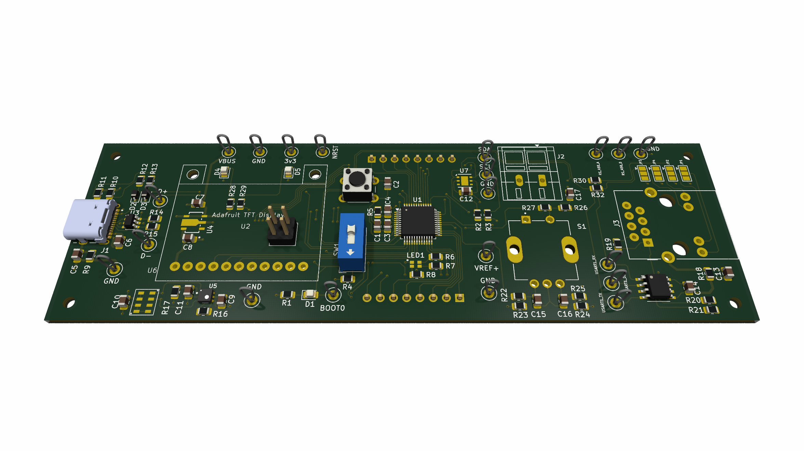

# STM32 Dev Board

Carte de développement autour d'un microcontrôleur STM32, conçue pour l'acquisition de données environnementales, la communication industrielle et l'expansion vers breadboard ou systèmes embarqués tiers.

> **Contenu actuel du dépôt :**
>- projet KiCad (schématique + layout PCB).
>- Lib static HAL (propre à ce PCB).
>- Projects exemple (utilisant la lib)

---



## Fonctionnalités PCB

### I²C - Capteur
Quatre capteurs partagent le même bus I²C :
- Pression barométrique
- Qualité de l'air (COV / CO₂ équivalent)
- Température
- Humidité relative

### SPI - Affichage & stockage
- Écran (Color TFT 160x80)
- Carte microSD

### USB
Connecteur **USB-C** câblé directement au microcontrôleur (Full-Speed).

### RS-485
Port **RJ45** utilisé comme connecteur de terrain pour un bus **RS-485** :
- Piloté via **UART** du MCU
- **Pin de direction** (DE/RE) exposé pour la gestion half-duplex
- Alimentation **48 V** optionnelle injectée sur le bus RS-485 et sur le RJ45 via un connecteur **Wago** monté sur la carte (alimentation fantôme ou PoE industriel)

### Interface utilisateur
- **LED RGB**
- **Encodeur rotatif** avec bouton-poussoir

### Port B - Extension
Deux **pin headers 8 broches** (2 × 8 = 16 broches) exposant l'intégralité du **Port B** du STM32. Permet de connecter la carte à une breadboard, un shield ou tout autre sous-système externe sans soudure.

---

## Structure du dépôt

```
C:.
│   README.md
│   
├───documentation
│   │   .gitignore
│   │   *.pdf
│   │   
│   ├───datasheet
│   │       *.pdf
│   │       
│   └───script
│           Datasheet_Downloader.py
│           Digikey_Datasheet_List.csv
│           requirements.txt
│           
├───hardware
│   │   .gitignore
│   │   STM32_DevBoard.kicad_pcb
│   │   STM32_DevBoard.kicad_prl
│   │   STM32_DevBoard.kicad_pro
│   │   STM32_DevBoard.kicad_sch
│   │   STM32_DevBoard.pdf
│   │   STM32_DevBoard.png
│   │       
│   ├───3d_models
│   │       *.step
│   │       
│   ├───footprints
│   │       *.kicad_mod
│   │       
│   └───symbols
│           *.kicad_sym
│           
└───software
    │   .gitignore
    │   arm-none-eabi.cmake
    │   CMakeLists.txt
    │   stm32c0.ld
    │           
    ├───Blinky
    │   │   CMakeLists.txt
    │   │   
    │   └───src
    │           main.c
    │                       
    └───DevBoard_HAL
        │   CMakeLists.txt
        │   
        └───src
            │   init.c
            │   rgb_led.c
            │   startup.c
            │   
            └───headers
                    init.h
                    registers.h
                    rgb_led.h
                    STM32_DevBoard.h
                    
```

---

## Prérequis

- **KiCad 8.x** ou supérieur
- Bibliothèques KiCad standard 
- CMake
- arm-none-eabi
- STM32Cube-Programmer
---

## Mise en route

### Compilation
crée un dossier build dans `software/`, initialiser cmake, puis compiler.

```
mkdir software/build
cd software/build
cmake -DCMAKE_TOOLCHAIN_FILE="../arm-none-eabi.cmake" ..
cmake --build .
```

Cela va buils le HAL ainsi que toutes la applications. Le premier build peut prendre plus de temps. Les binaire des applications se trouvent dans `software/bin/le_nom_de_lapp/`

---

## Futures Amleliorations

- Ajuster les dimension du PCB
- Réduire la taille du PCB
- Ajout de pin d'alimentation et de masse sur les pin du port B
- Diodes TVS et sécurité sur bus RS_485 (Alim et signaux)
- Implémenter protocole power delivery USB-C (48V sur usb-c et non wage par exemple ou que le STM32 puisse connaitre les capacité de l'alim)

---